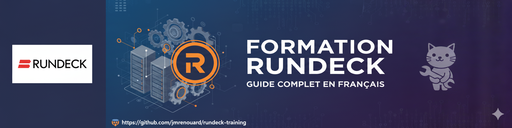

# Projet d'Automatisation et de Déploiement de Rundeck

Ce projet fournit une collection complète d'outils pour déployer, configurer et gérer un environnement Rundeck. Il est divisé en plusieurs répertoires, chacun se concentrant sur un aspect spécifique de l'automatisation.

## Composants Principaux

### [Ansible](./ansible/README.md)
Ce répertoire contient les playbooks et les rôles Ansible pour automatiser le déploiement de la stack Rundeck (Java, MySQL, Rundeck, Keycloak, MinIO).

### [Docker](./docker/README.md)
Vous trouverez ici les configurations Docker pour lancer rapidement un environnement de développement local ou de production avec Docker Compose et Docker Swarm.

### [Scripts](./scripts/README.md)
Une collection de scripts Bash pour une installation manuelle et automatisée de la stack Rundeck et de ses composants (comme MinIO) sur un système Ubuntu.

### [Templates](./templates/README.md)
Contient une bibliothèque riche et variée de plus de 40 templates de jobs Rundeck au format YAML. Ces templates couvrent une large gamme de cas d'usage pour les plateformes Linux et Windows, incluant le déploiement d'applications, l'intégration avec MinIO/S3, la maintenance système, les opérations de sauvegarde/restauration, le reporting, et la gestion de la sécurité.

## Utilitaires

### [aclpolicy](./aclpolicy/README.md)
Ce répertoire contient un générateur de fichier `ACLPolicy` pour Rundeck. Il fournit une interface web pour créer et gérer les politiques de contrôle d'accès de manière intuitive.

### [ressources](./ressources/README.md)
Ce répertoire contient un générateur de fichier de modèle de ressources pour Rundeck. C'est un outil web qui simplifie la création de fichiers YAML définissant les nœuds cibles pour les jobs.
